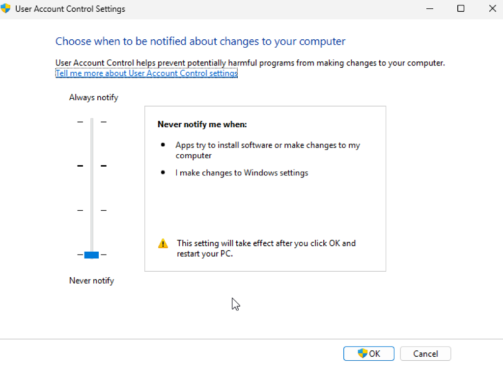
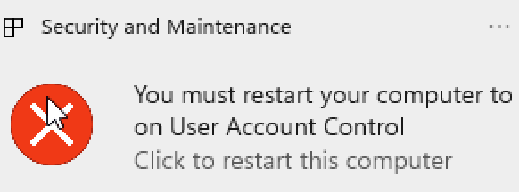
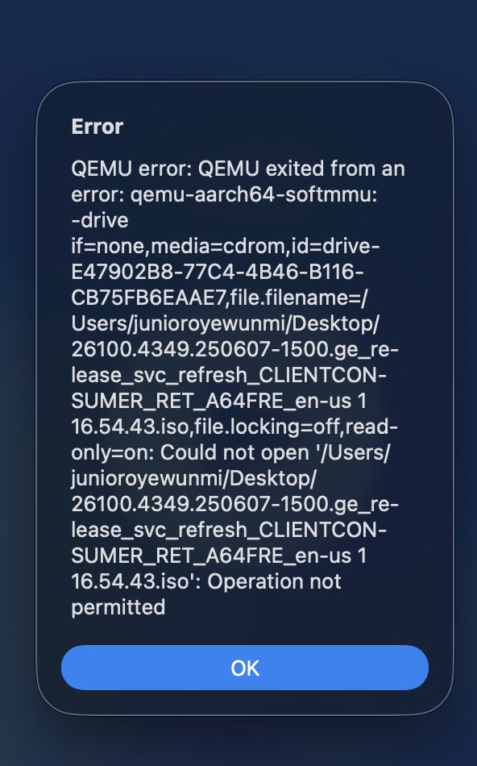
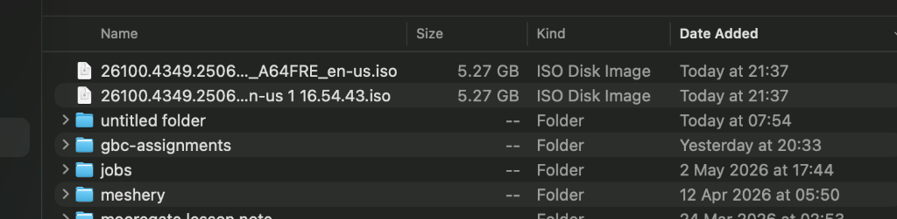
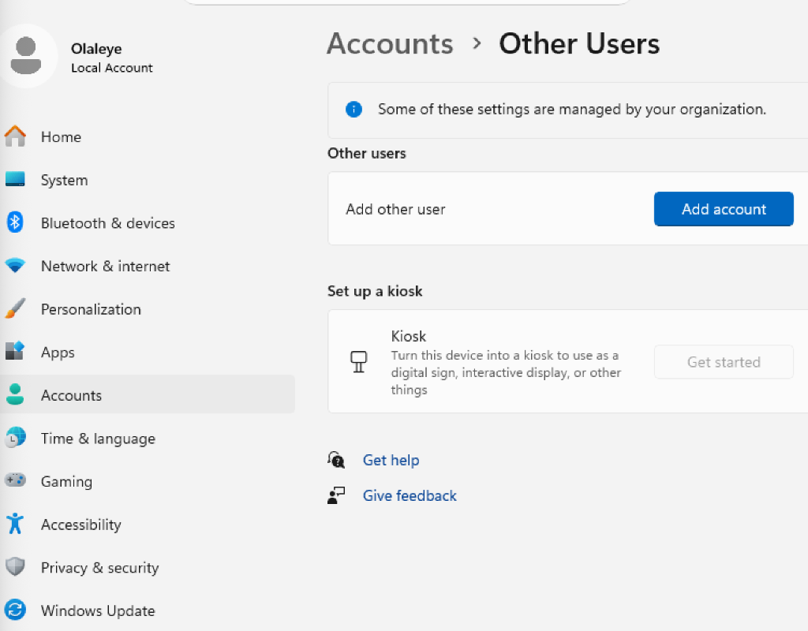
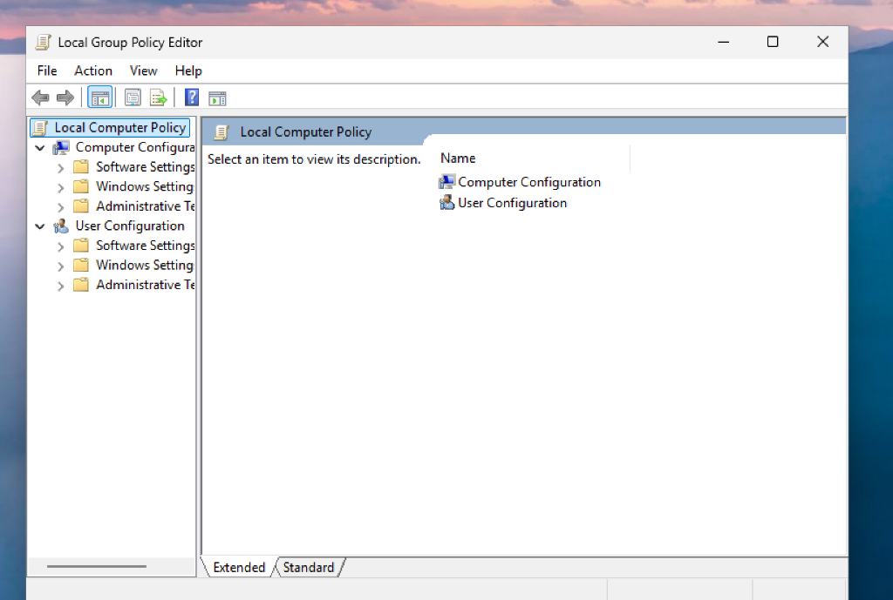
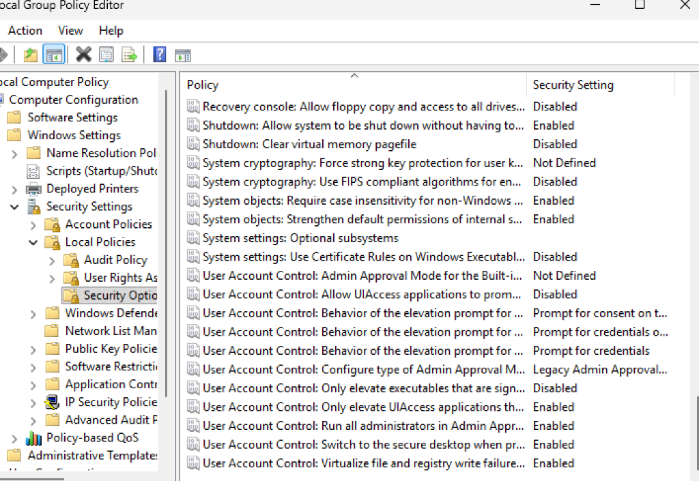
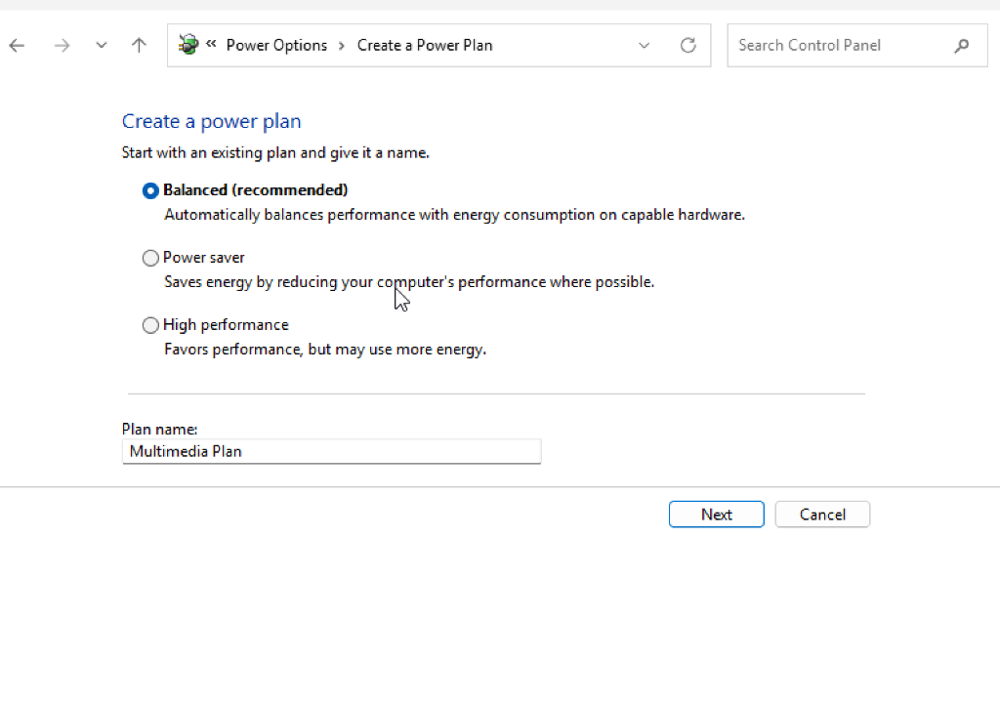

# Activity D02: Windows 11 User Management & Customization

## Setup Environment & Virtualization

**Host Operating System:** macOS (Apple Silicon / Mac)  
**Target Environment:** Windows 11 ARM64 (Virtual Machine via UTM)

### Why a Virtual Machine was required
This activity involves managing local user accounts, configuring User Account Control (UAC) policies, and modifying system-level settings like Power Plans and Start Layouts. Performing these tasks on a Virtual Machine (VM) ensures that the host macOS system remains untouched while providing a safe, isolated environment to experiment with Windows-specific administrative tools like the **Local Group Policy Editor** and **PowerShell ISE**.

---

## Activity 1: Managing Local User & Microsoft Account Authentication

**Scenario:** Create two local user accounts (User1 as Administrator, User2 as Standard). Link a Microsoft account to User1 and configure Windows Hello with a PIN.

### Step-by-Step Implementation:

#### Step 1: Create Local Accounts
1. Open **Settings** > **Accounts** > **Other users**.
2. Click **Add account**.
3. Select **"I don't have this person's sign-in information"** and then **"Add a user without a Microsoft account"**.
4. Create **User_Admin_Test** and **User2**.
   *   **Novice Tip:** Creating a "user without a Microsoft account" is essential for local administrative testing. This allows you to manage the account entirely within the VM without needing an external email address!



#### Step 2: Elevate User_Admin_Test to Administrator
1. In the **Other users** list, click on **User_Admin_Test**.
2. Select **Change account type**.
3. Change the account type from "Standard User" to **Administrator**.



---

## Activity 2: Configuring User Account Control (UAC)

**Scenario:** Configure UAC to require administrator credentials for elevation and restrict unsigned applications.

### Step-by-Step Implementation:

#### Step 1: Adjust UAC Levels
1. Search for **UAC** in the Start menu and select **Change User Account Control settings**.
2. Move the slider to **"Always notify"**.



#### Step 2: Configure Policy for Standard Users
1. Press `Win + R`, type `gpedit.msc`, and press **Enter**.
2. Navigate to: `Computer Configuration` > `Windows Settings` > `Security Settings` > `Local Policies` > `Security Options`.
3. Locate **"User Account Control: Behavior of the elevation prompt for standard users"** and set it to **"Prompt for credentials"**.
   *   **Novice Tip:** By setting this to "Prompt for credentials," a standard user (like User2) will be forced to ask for an administrator's password whenever they try to install software or change system settings!



---

## Activity 3: Configuring Settings & Power Plans

**Scenario:** Analyze device specs, identify startup bottlenecks, and create a custom power plan.

### Step-by-Step Implementation:

#### Step 1: Analyze Startup Impact
1. Right-click the Taskbar and select **Task Manager**.
2. Go to the **Startup apps** tab and identify "High impact" apps.
   *   **Novice Tip:** Disabling "High impact" apps that you don't use can significantly speed up how fast your Windows VM boots up!



#### Step 2: Create "Multimedia" Power Plan
1. Open **Control Panel** > **Power Options**.
2. Click **Create a power plan**, name it **"Multimedia Plan"**, and configure it for balanced performance.



---

## Activity 4: Using PowerShell for System Audit

**Scenario:** Use PowerShell ISE to list all currently running services.

### Step-by-Step Implementation:
1. Launch **PowerShell ISE** as Administrator.
2. Enter the following command:
   ```powershell
   Get-Service | Where-Object {$_.Status -eq "Running"}
   ```
3. Click **Run Script** (Play button) and verify the output.



---

## Activity 5 & 6: Start Layout & Taskbar Policy

**Scenario:** Customize the Start menu and export the layout for deployment via Group Policy.

### Step-by-Step Implementation:
1. Pin **Snipping Tool**, **Sticky Notes**, and **Weather** to Start.
2. Export the layout via PowerShell: `Export-StartLayout -Path "C:\StartLayout.json"`.
3. In **Group Policy Editor**, navigate to `Administrative Templates` > `Start Menu and Taskbar` and enable the **Start Layout** policy.



---

## Final Verification & Troubleshooting

### Troubleshooting: "gpedit.msc not found"
*   **Issue:** If you are using Windows 11 **Home** edition, the Group Policy Editor is disabled by default.
*   **Resolution:** Ensure you are using **Windows 11 Pro** (as selected in the VM setup) to access these administrative features.

### Final Checkpoint
- [ ] User_Admin_Test is an Administrator.
- [ ] UAC is set to "Always Notify".
- [ ] PowerShell script returns a list of running services.
- [ ] "Multimedia" power plan is active.

---
*End of Activity D02 Document*
