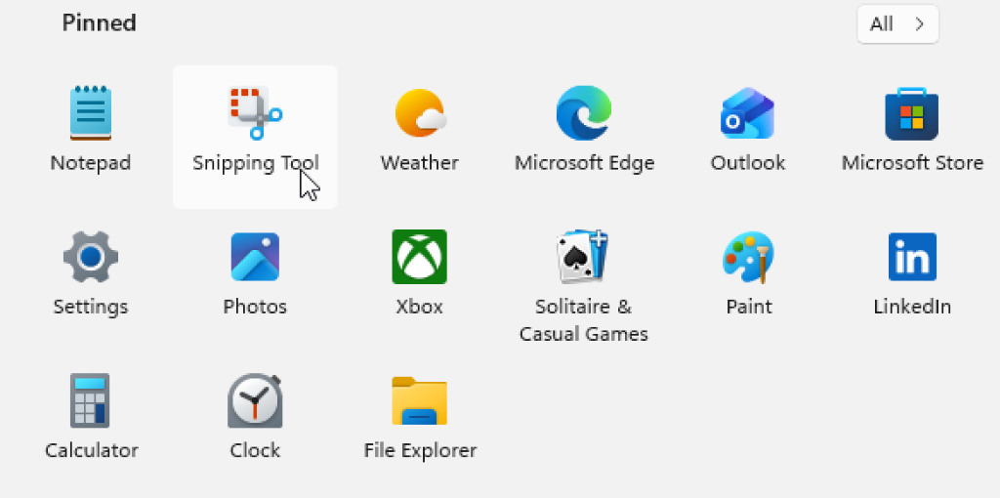
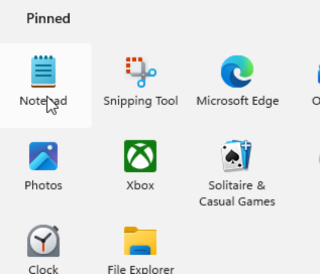
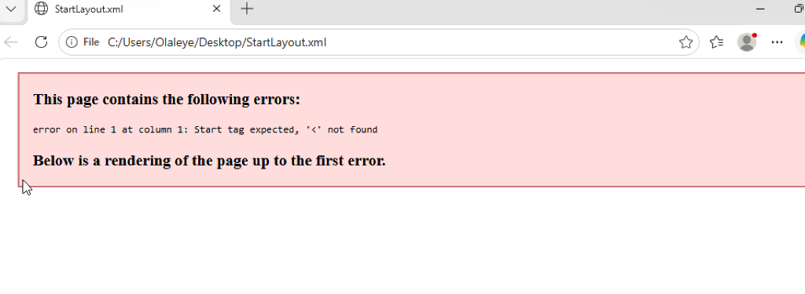
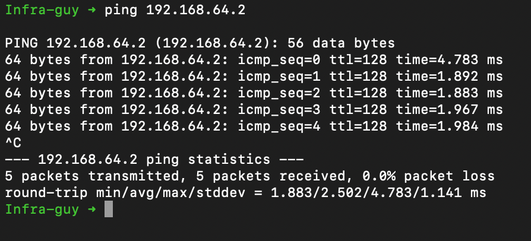
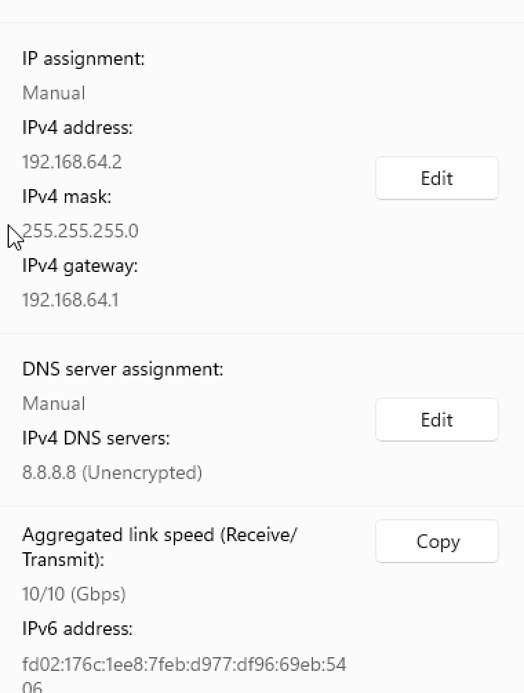
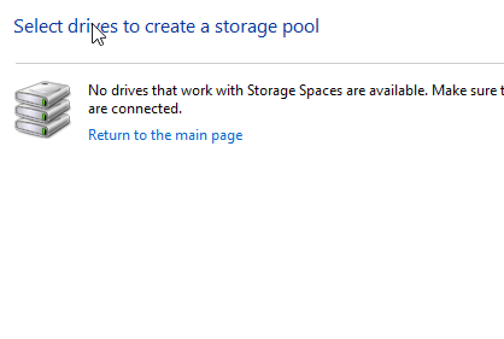

# Activity D03: Networking, Remote Admin & Storage

## Setup Environment & Virtualization

**Host Operating System:** macOS (Apple Silicon / Mac)  
**Target Environment:** Windows 11 ARM64 (Virtual Machine via UTM)

### Why a Virtual Machine was required
Networking and storage administration often require modifying system-level hardware configurations, such as adding virtual disks or changing IP addresses. Using UTM on macOS allows us to simulate a complex network environment and manipulate "virtual" hardware (like adding 3-4 extra hard drives) without needing to purchase physical equipment or risk the host system's connectivity.

---

## Activity 1: Verifying & Testing IPv4 Connectivity

**Scenario:** Identify the VM's static or dynamic IPv4 settings and test connectivity from the macOS host.

### Step-by-Step Implementation:

#### Step 1: VM Network Audit
1.  Open **Command Prompt** (cmd) and run:
    ```cmd
    ipconfig /all
    ```
2.  Identify the **IPv4 Address**, **Subnet Mask**, and **Default Gateway**.
   *   **Novice Tip:** The **Default Gateway** is like the "exit door" of your network. It's the address of the router that lets your VM talk to the outside world!



#### Step 2: Host-to-VM Ping Test
1.  On your Mac, open **Terminal**.
2.  Type `ping [VM_IP_ADDRESS]` and press Enter.
3.  Verify that you receive "Reply" messages.



---

## Activity 2: Configuring Static IPv4 Settings

**Scenario:** Manually assign an IP address to ensure the VM's network identity doesn't change.

### Step-by-Step Implementation:
1.  Go to **Settings** > **Network & internet** > **Ethernet**.
2.  Click **Edit** next to "IP assignment" and change it to **Manual**.
3.  Enable **IPv4** and enter your chosen IP details.
   *   **Novice Tip:** A **Static IP** is like a permanent home address. It ensures that every time you turn on your VM, it has the exact same number, making it easier for other computers to find it!



---

## Activity 3: Troubleshooting Name Resolution (Hosts File)

**Scenario:** Map a custom domain (`www.Contoso.com`) to a specific IP address using the local hosts file.

### Step-by-Step Implementation:
1.  Search for **Notepad**, right-click it, and **Run as Administrator**.
2.  Open `C:\Windows\System32\drivers\etc\hosts`.
3.  Add the line: `1.2.3.4 www.Contoso.com`.
4.  Open Command Prompt and run `ipconfig /flushdns`.
5.  Ping `www.Contoso.com` to verify the new mapping.



---

## Activity 4: Remote Management (PSRemoting & RDP)

**Scenario:** Enable Remote Desktop and PowerShell Remoting for administrative support.

### Step-by-Step Implementation:
1.  Go to **Settings** > **System** > **Remote Desktop** and toggle it **On**.
2.  Open PowerShell as Administrator and run:
    ```powershell
    Enable-PSRemoting -Force
    ```



---

## Activity 5 & 6: Disk Management & Storage Spaces

**Scenario:** Create a simple volume and a resilient "Two-way mirror" storage pool using multiple virtual disks.

### Step-by-Step Implementation:

#### Step 1: Add Virtual Hardware (UTM)
1.  Shut down the VM.
2.  In UTM settings, click **New Drive** and create 3-4 small drives (e.g., 2GB each).
3.  Restart the VM.

#### Step 2: Initialize & Mirror
1.  Press `Win + X` and select **Disk Management**.
2.  Initialize the new disks as **GPT**.
3.  Search for **"Storage Spaces"** in the Start menu.
4.  Create a new pool and select the disks to form a **Two-way mirror**.
    *   **Novice Troubleshooting Note:** If you see an "Insufficient Capacity" error, it often means the disks are already initialized or have hidden partitions. Use the `diskpart` > `clean` command in an Admin command prompt to wipe the disks completely before pooling!



---

## Final Verification & Troubleshooting

### Troubleshooting: Ping Fails (Request Timed Out)
*   **Resolution:** Windows Firewall often blocks "ICMP" (ping) requests. To fix this, use the following command in PowerShell (Admin):
    ```powershell
    netsh advfirewall firewall add rule name="Allow ICMPv4" protocol=icmpv4:8,any dir=in action=allow
    ```

### Final Checkpoint
- [ ] VM responds to ping from Mac.
- [ ] `www.Contoso.com` resolves to `1.2.3.4`.
- [ ] A new mirrored drive is visible in File Explorer.

---
*End of Activity D03 Document*
