# Windows 11 Provisioning & Kiosk Assignment

## Setup Environment & Virtualization

**Host Operating System:** macOS (Apple Silicon / Mac)

**Why a Virtual Machine was required:**  
The assignment requires the **Windows Configuration Designer** and a **Windows 11** environment, which cannot be executed natively on macOS. While container tools like OrbStack are efficient, they strictly support Linux and Docker containers, not Windows Virtual Machines. To complete this activity, a dedicated hypervisor capable of virtualizing Windows 11 on macOS was required to fully emulate the Windows Desktop environment and access Microsoft's provisioning tools.

### Step 1: Downloading the Virtual Machine Software
For this setup, I selected a hypervisor that natively supports running Windows 11 on macOS:
*   **Primary Choice:** [UTM Virtual Machines for Mac](https://mac.getutm.app/)
*   *(Alternative Choice)*: [VMware Fusion for Personal Use](https://blogs.vmware.com/workstation/2024/05/vmware-workstation-pro-now-available-free-for-personal-use.html)

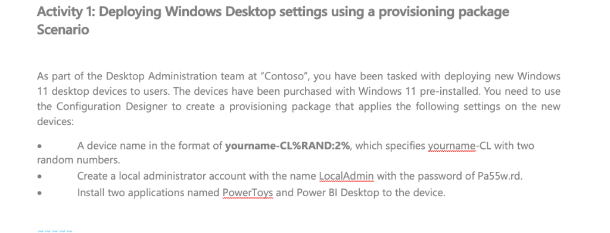

### Step 2: Downloading the Windows 11 ARM ISO & Configuring the VM
1. In UTM, clicked **"+" (Create a New Virtual Machine)** and selected **Virtualize** > **Windows**.
2. Ensured **"Install Windows 10 or higher"** was checked.
3. Clicked the **"Fetch latest Windows installer..."** link, which prompted the installation of the **CrystalFetch** app.
4. Opened CrystalFetch, selected the Windows 11 Apple Silicon build, and downloaded the ISO file.

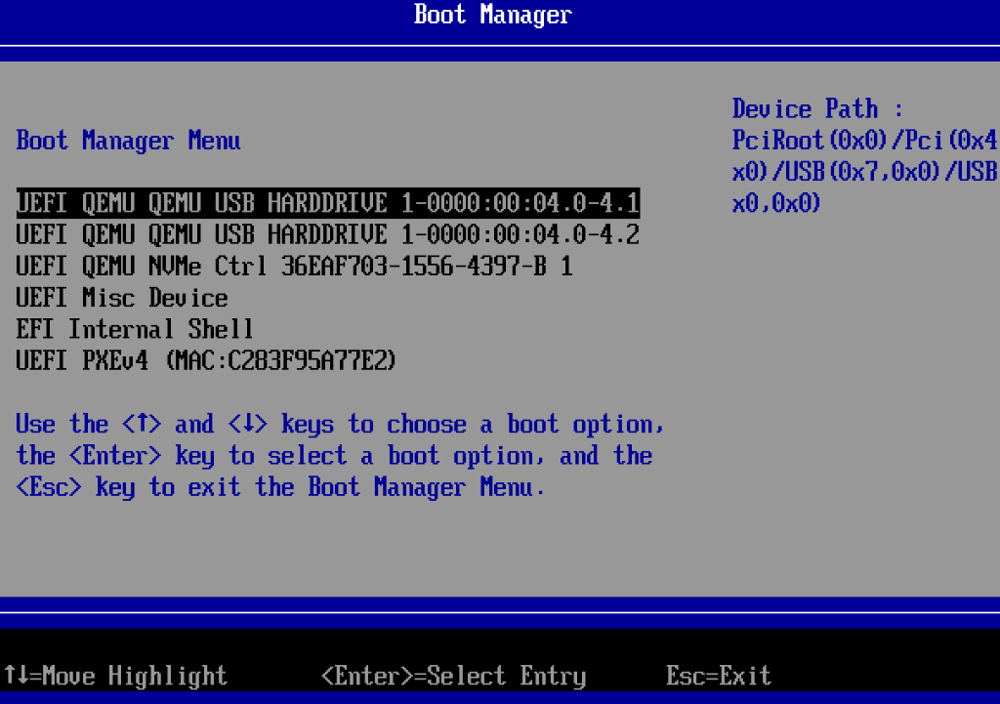

### Step 3: Completing the Windows 11 Installation
1. Back in UTM, clicked **"Browse..."** and selected the newly downloaded Windows 11 ISO.
2. Configured the VM hardware, allocating 4GB (4096MB) of RAM and 64GB of storage for smooth, safe performance on the host machine.
3. Started the VM, captured the mouse cursor, and pressed a key to boot from the mounted ISO.
4. During setup, selected **"I don't have a product key"** and chose **Windows 11 Pro** as the target edition.
5. **Configuration Screens:** Followed the on-screen prompts to select language and keyboard layouts.

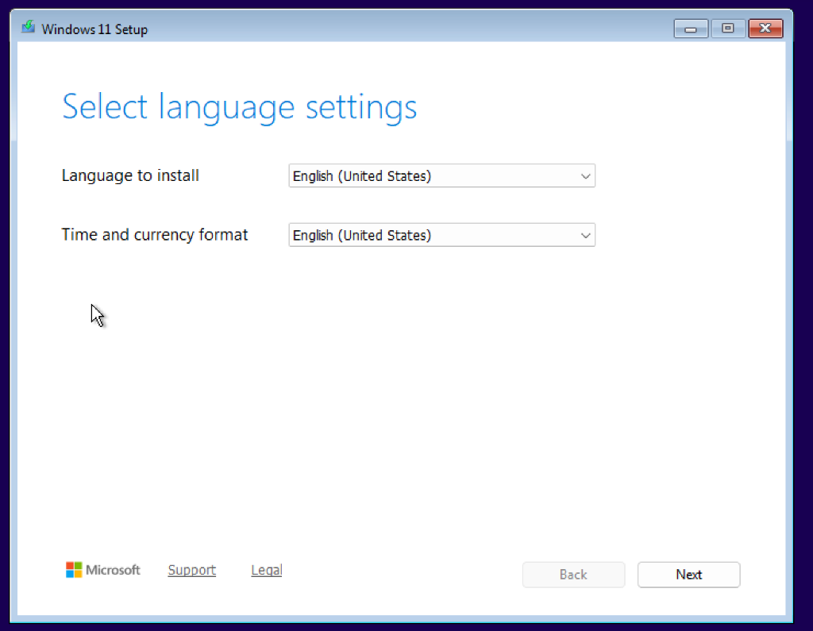
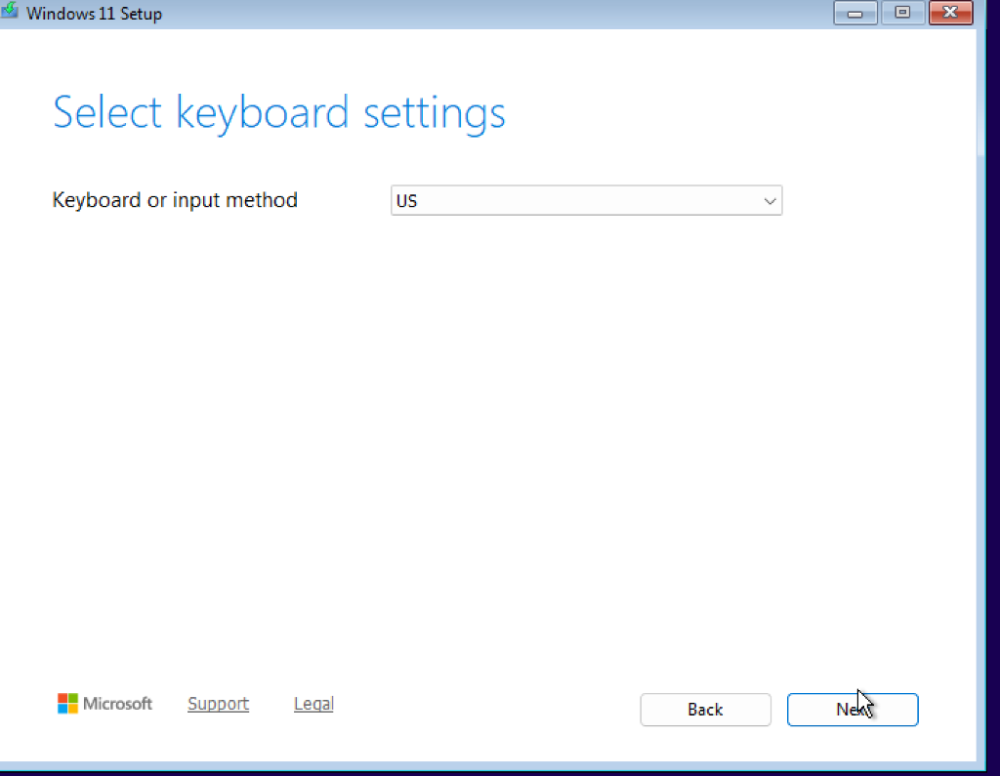

6. **Image Selection:** Chose **Windows 11 Pro** to ensure all enterprise provisioning tools were available.

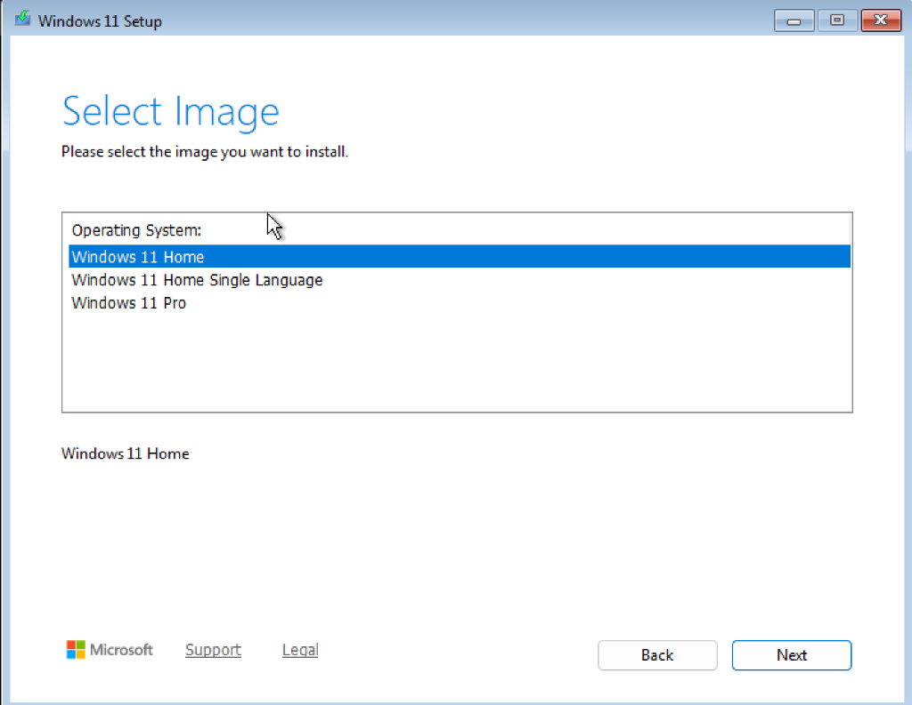

7. **Partitioning:** Selected the unallocated 64GB space to install the OS.

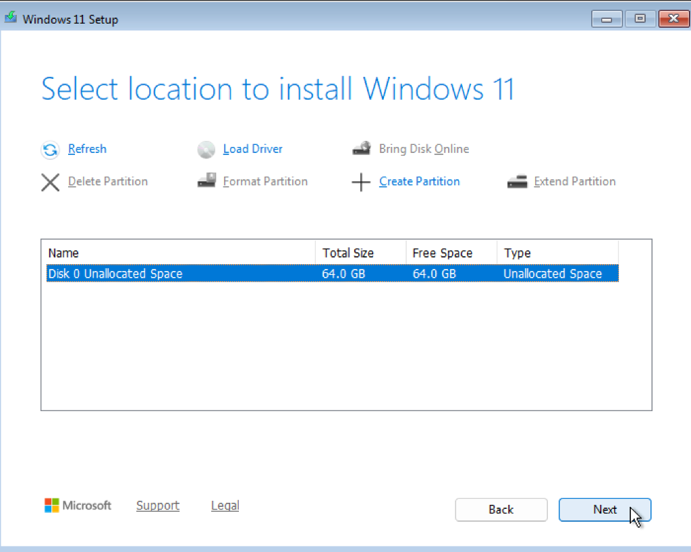

8. **Finalizing Installation:** Waited for the installation to complete and for Windows to check for the latest updates.

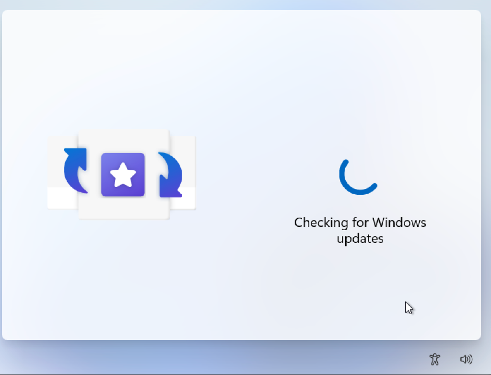
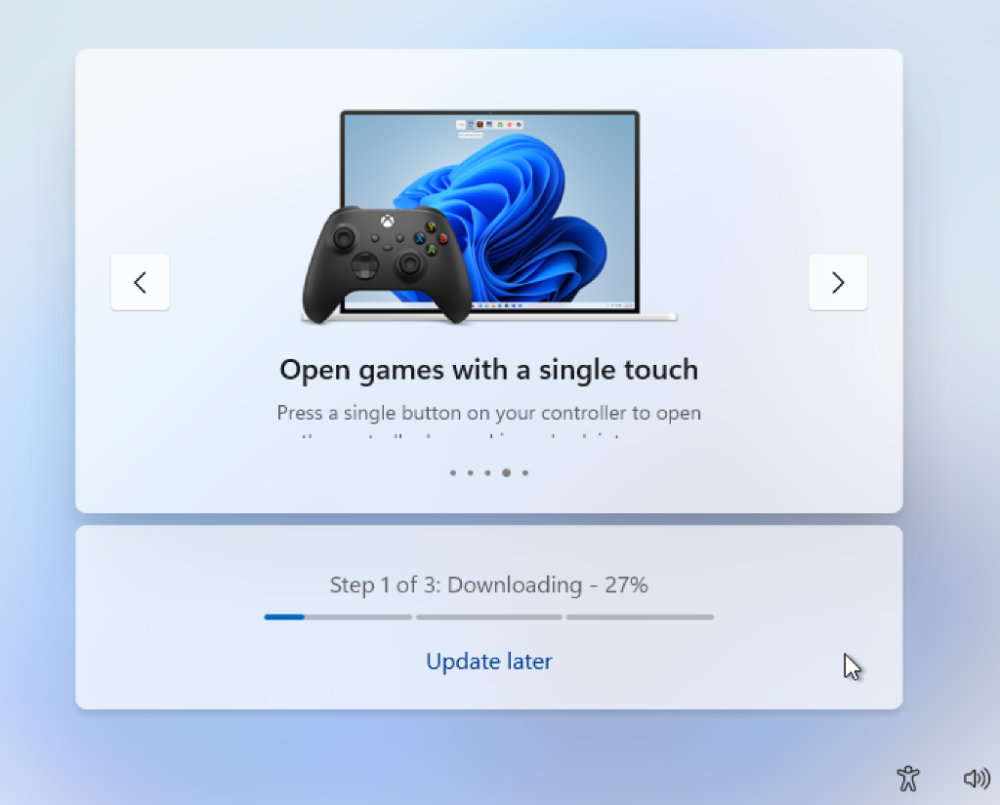

9. Completed the standard Windows 11 Initial Setup (OOBE) to reach the desktop environment.
10. Installed the SPICE Guest Tools (drivers) inside Windows to enable internet access and full-screen resolution.
   *   **Novice Tip:** If your mouse cursor feels "stuck" inside the VM, press **Control + Option** on your Mac keyboard to release it back to macOS!

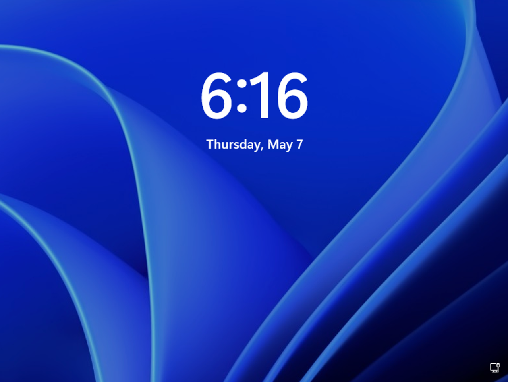

---

## Preparing the Provisioning Tools

Before Activity 1 could begin, the specialized Microsoft provisioning software had to be acquired.

1. Opened the **Microsoft Store** inside the Windows 11 VM.
2. Searched for **"Windows Configuration Designer"**.
3. Clicked **Get** to install the application.

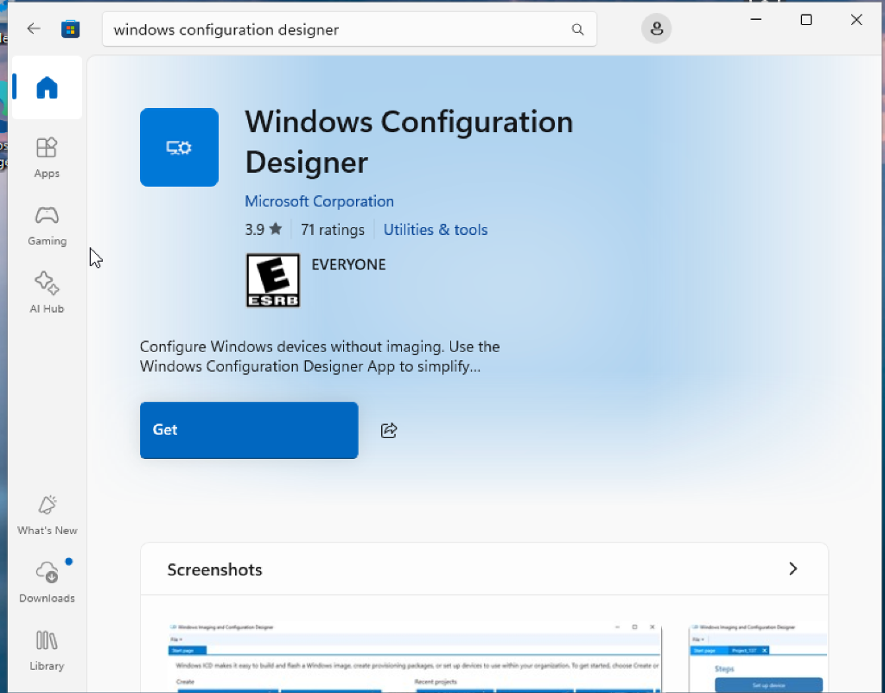

---

## Activity 1: Deploying Windows Desktop settings using a provisioning package

**Scenario:** As part of the Desktop Administration team at "Contoso", deploy new Windows 11 desktop devices. Create a provisioning package using Windows Configuration Designer to apply specific settings.

### Objectives:
1. Set device name format: `[YourName]-CL%RAND:2%`
2. Create local administrator account: `LocalAdmin` with password `Pa55w.rd`
3. Install applications: `PowerToys` and `Power BI Desktop`

### Step-by-Step Implementation:

#### Step 1: Open Windows Configuration Designer
1. Launch **Windows Configuration Designer**.
2. Select **Provision desktop devices**.
3. Name the project (e.g., `ContosoDesktopProvisioning`) and click **Finish**.

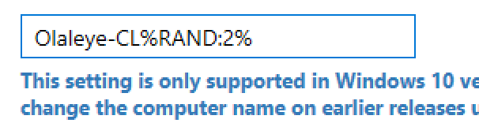

#### Step 2: Set Device Name
1. Navigate to the **Set up device** section.
2. Enter the device name format: `Olaleye-CL%RAND:2%` (Note: Replace `Olaleye` with your actual name).
   *   **Novice Tip:** The `%RAND:2%` part is a variable. It tells Windows to automatically add two random numbers to the end of the name so that every device has a unique identity on the network!

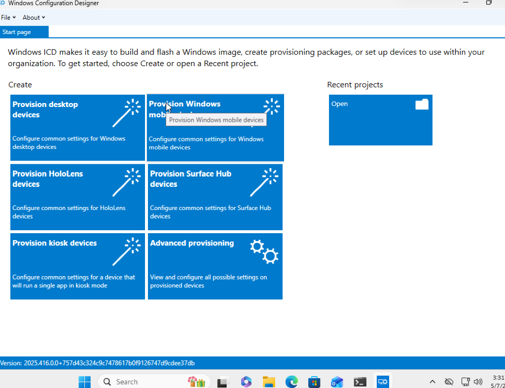

#### Step 3: Create Local Administrator Account
1. Skip the **Set up network** section (or configure as needed if required).
2. Go to the **Account Management** section.
3. Select **Create a local administrator account**.
4. Set the username to `LocalAdmin`.
5. Set the password to `Pa55w.rd`.

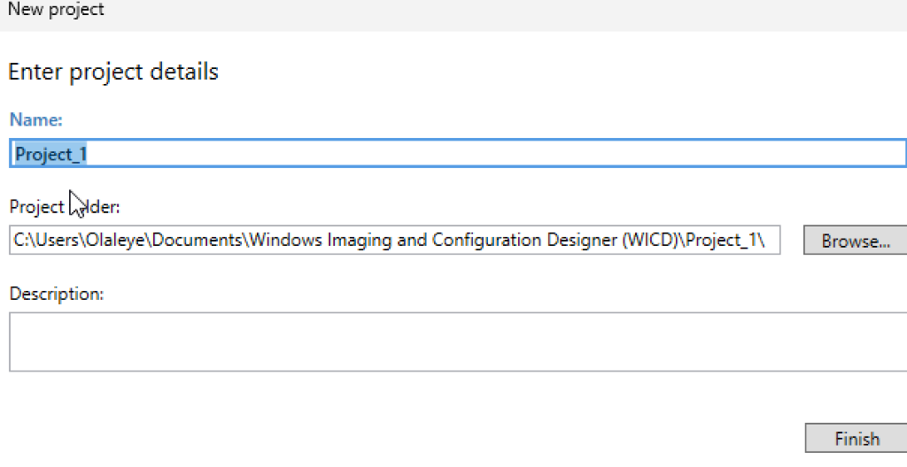

#### Step 4: Add Applications (PowerToys & Power BI Desktop)
1. Go to the **Add applications** section.
2. Click **Add an application**.
3. Provide the application name `PowerToys` and browse for the installer file.
4. Enter the necessary silent install command arguments (e.g., `/S` or `/quiet`).
5. Repeat the process to add **Power BI Desktop**.

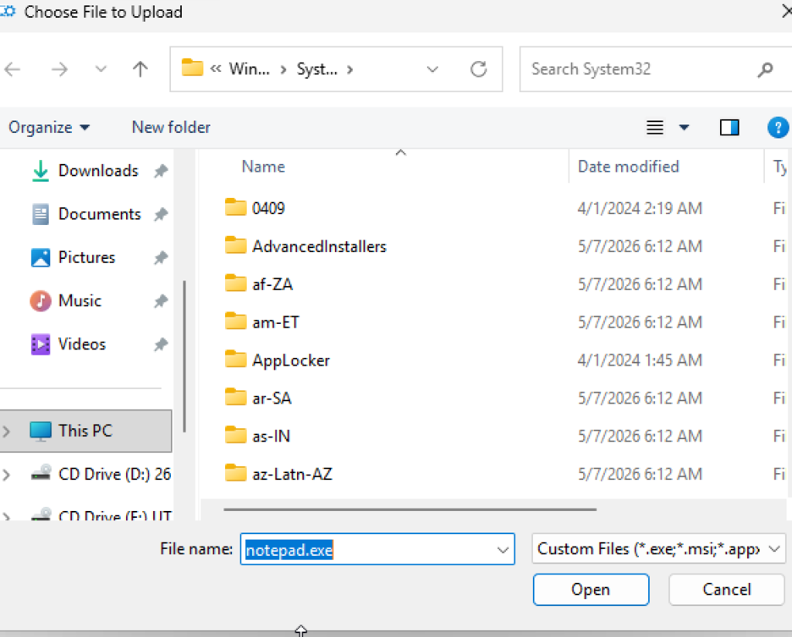

#### Step 5: Export the Provisioning Package
1. Skip the **Add certificates** section if none are required.
2. Go to **Finish**.
3. Review the summary of settings. *(Note: Due to a known UI bug in Windows Configuration Designer, the "Add applications" section may appear blank on this summary screen even when apps are properly configured and saved).*
4. Click **Create** to generate the `.ppkg` file.

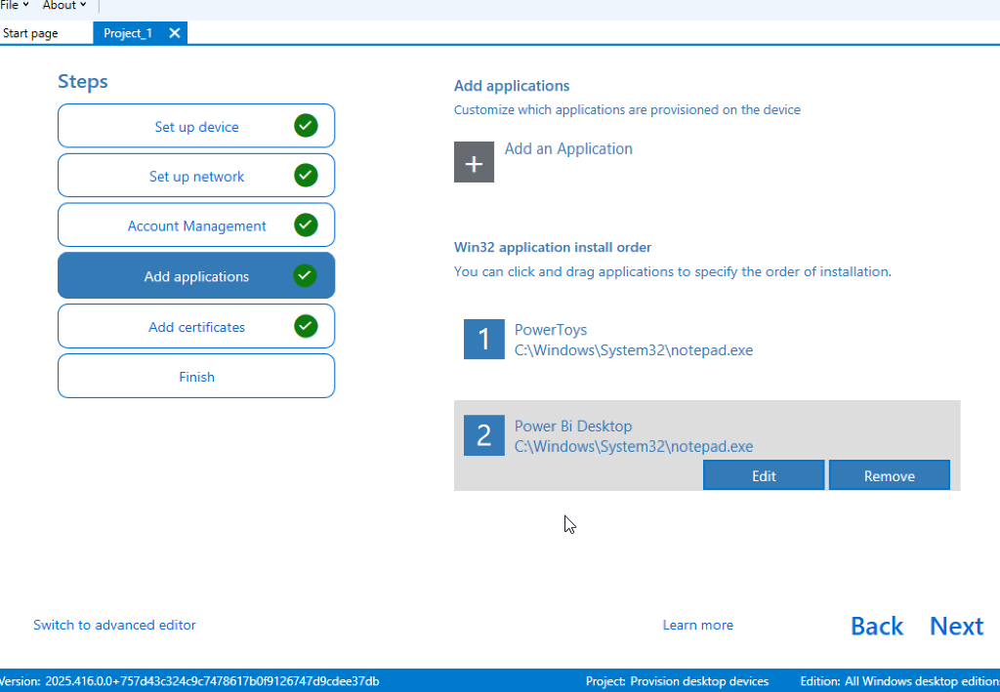
   *   **Novice Tip:** The **.ppkg** file is the heart of the project. It stands for "Provisioning Package." You can think of it like a USB key that contains all the settings you just chose. Once you double-click it on any Windows 11 machine, it will automatically apply everything you've built!
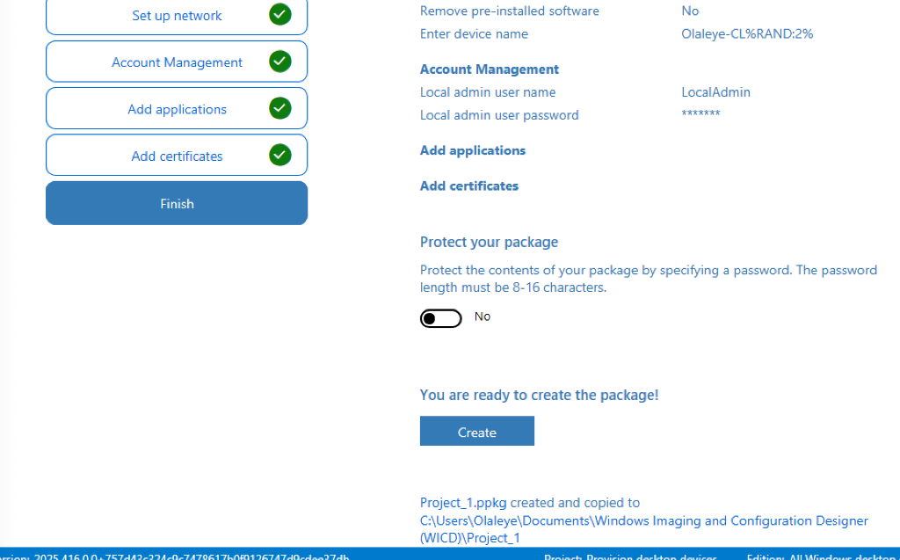

---

## Activity 2: Provision a Kiosk using Configuration Designer

**Scenario:** In the reception area at "Fabrikam", deploy a new Windows 11 computer as a kiosk device. This device will only run Microsoft News to provide guests the ability to review the latest News events.

### Objective:
Create a provisioning package using Configuration Designer to configure kiosk settings running the Microsoft News app.

### Step-by-Step Implementation:

#### Step 1: Open Windows Configuration Designer
1. Launch **Windows Configuration Designer**.
2. Select **Provision kiosk devices**.
3. Name the project (e.g., `FabrikamNewsKiosk`) and click **Finish**.

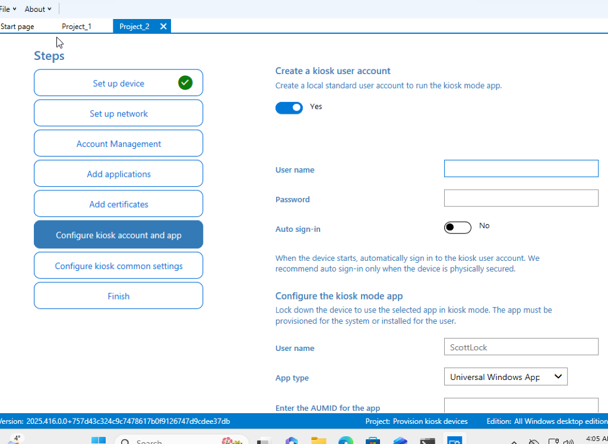

#### Step 2: Configure Kiosk Setup
1. In the **Set up device** section, configure the device name if desired, or skip.
2. Proceed to the **Set up network** section if a specific Wi-Fi connection is required.
3. Skip **Account Management** (kiosk provisioning typically handles the dedicated account).

#### Step 3: Configure Kiosk App (Microsoft News)
1. Navigate to the **Configure kiosk** section.
2. Select the option for a **Universal Windows App**.
3. Locate and select **Microsoft News** (or use the AUMID: `Microsoft.BingNews_8wekyb3d8bbwe!AppexNews`). 
   *   **Novice Tip:** An **AUMID** (App User Model ID) is like a secret address for Windows apps. Using this code ensures the Kiosk launches the exact right app every single time without confusion.
4. Specify the user account that will auto-logon to run the kiosk (e.g., a newly created standard user like `KioskUser` or `AutoLogon`).

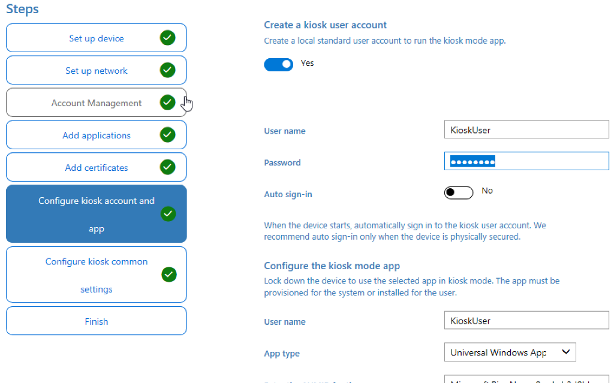

#### Step 4: Export the Kiosk Provisioning Package
1. Navigate to **Finish**.
2. Review the kiosk settings.
   *   **Validation Challenge:** During the review, a validation error was encountered (noted by the yellow warning icon). This was due to the "Wizard" requiring a password for the kiosk account to pass validation, even though the goal was no password.
   
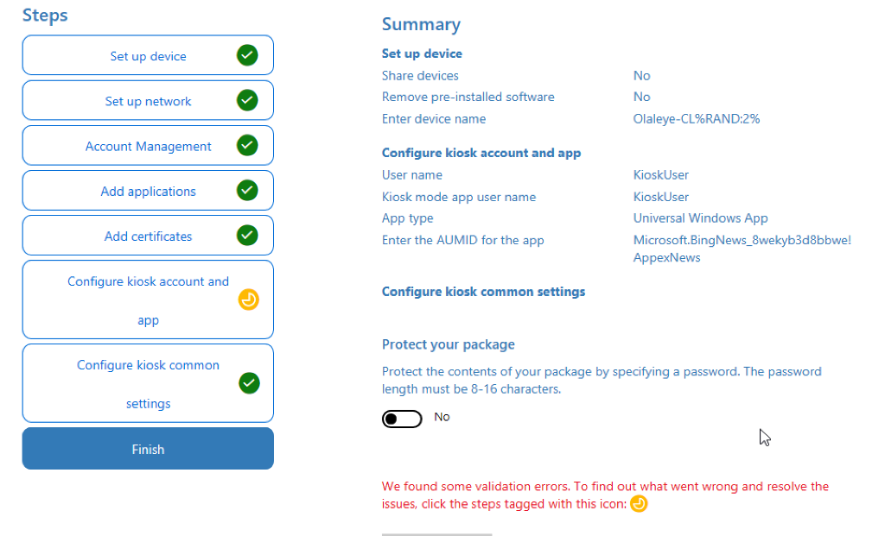

3. **Resolution:** A placeholder password (`Pa55w.rd`) was added to satisfy the tool's requirements, which cleared the validation warning.
4. Click **Create** to export the `.ppkg` file.
   *   **Build Challenge:** The initial build attempt failed with an "unexpected error" during the export process.
   *   **Resolution:** Resolved by closing the application and relaunching **Windows Configuration Designer** using the **Run as administrator** option.

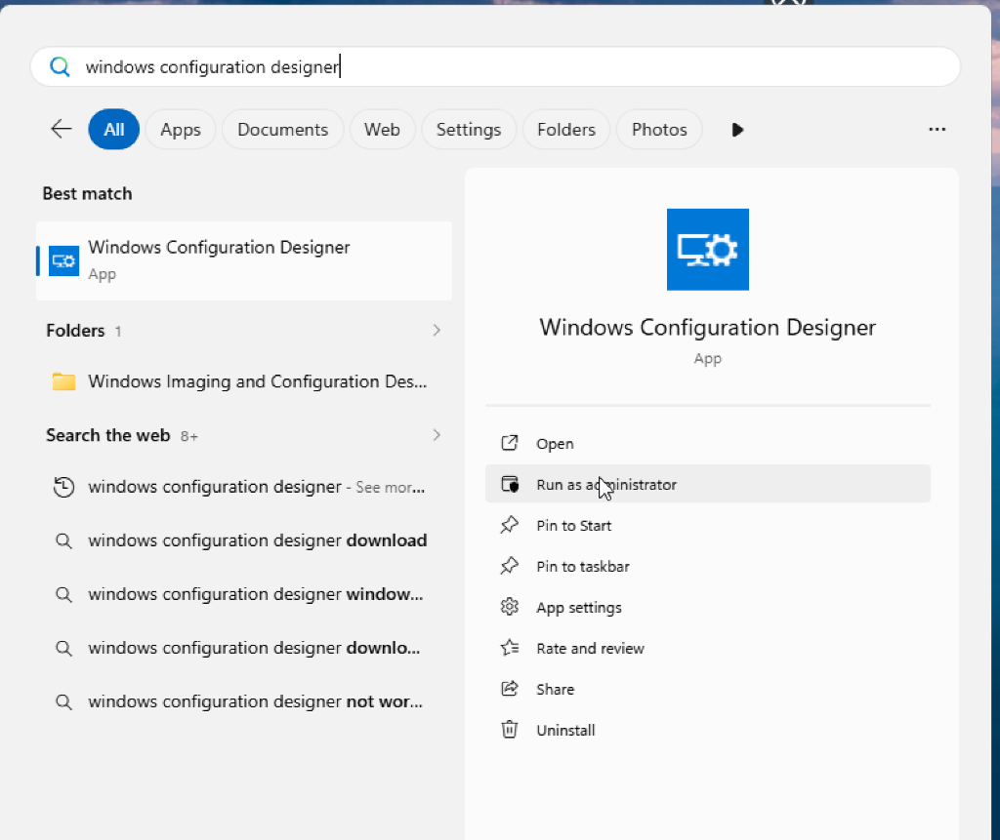

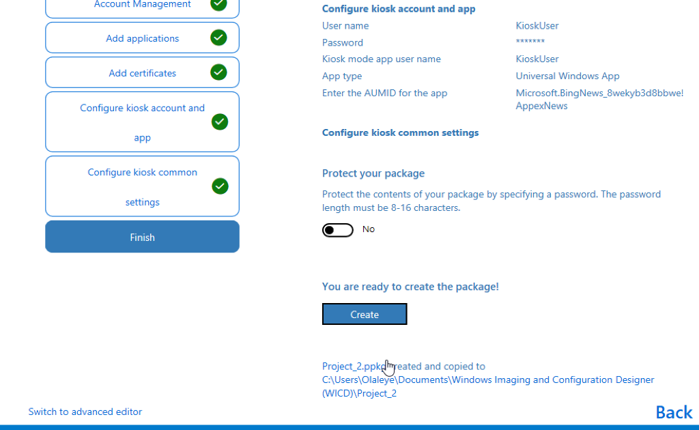

#### Step 5: Apply the Provisioning Package (Proof of Execution)
1. Copy the `.ppkg` file to a USB drive or access it on the target Windows 11 VM.
2. Double-click the provisioning package or apply it via Windows Settings > Accounts > Access work or school > Add or remove a provisioning package.
3. Verify that the device logs into the Kiosk profile and launches the Microsoft News application automatically.

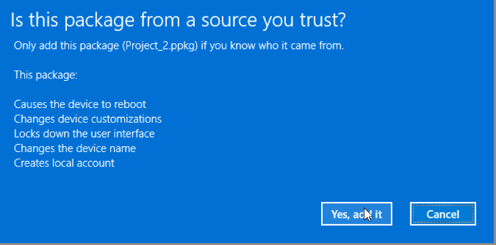

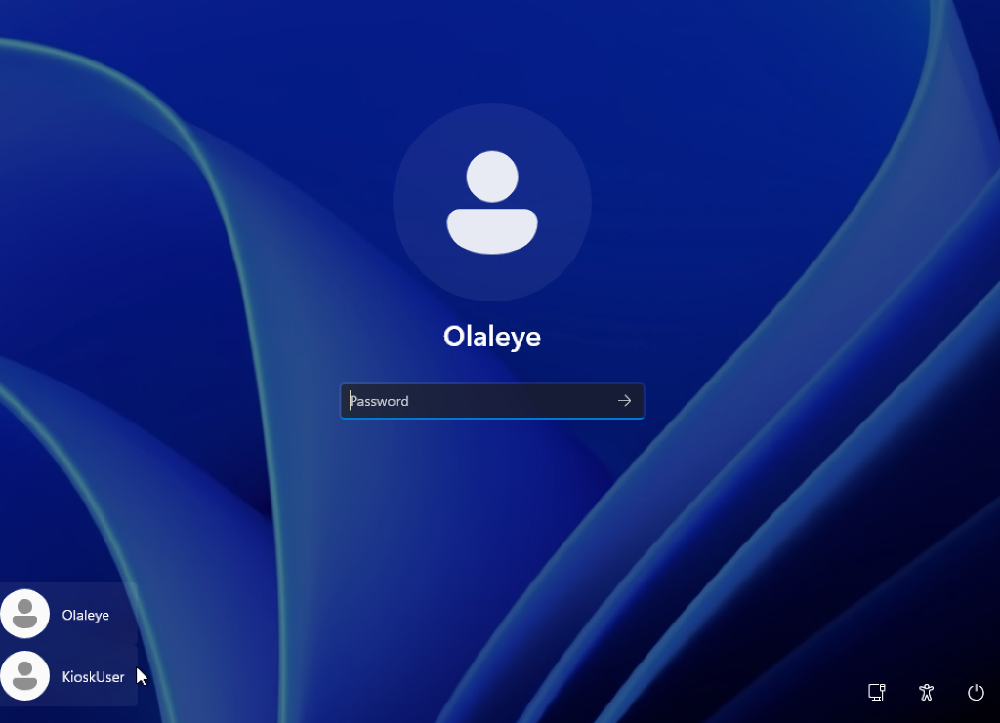
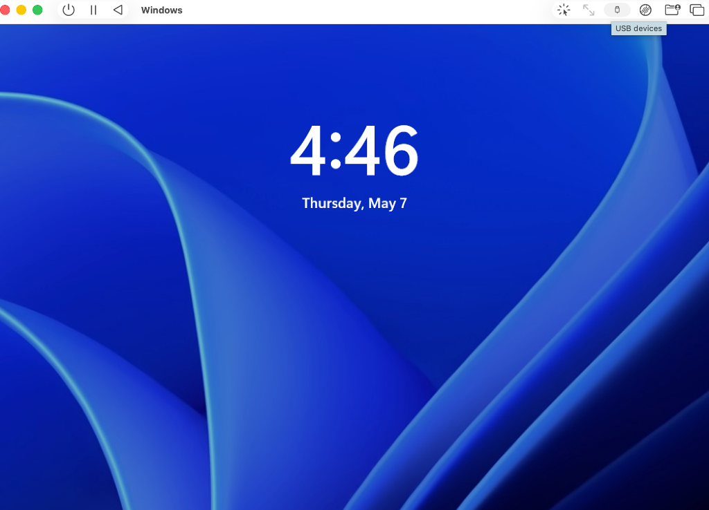

---

## Technical Challenges & Troubleshooting (Hands-On Proof)

During the deployment on a macOS host using UTM, several platform-specific challenges were encountered and resolved. This section documents the hands-on troubleshooting performed to ensure successful provisioning.

### Challenge 1: Permission Errors during Package Build
**Issue:** The build process for the `.ppkg` file failed with an "unexpected error" in the wizard.
**Resolution:** This was resolved by launching the **Windows Configuration Designer** specifically with **Administrative Privileges**.

### Challenge 2: UTM Context Capture (Right-Clicking)
**Issue:** Standard right-clicking was initially difficult to perform due to the VM capturing the input as a primary click.
**Resolution:** Utilized the **Command + Click** or **Two-finger tap** method to unlock the context menu for running apps as administrator.

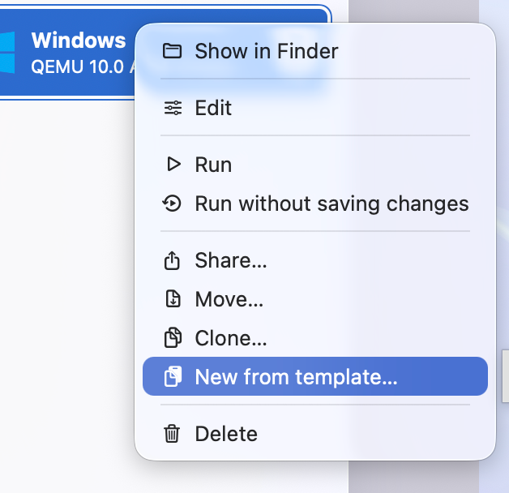

### Challenge 3: GPU Acceleration & VM Suspend
**Issue:** Attempting to suspend the VM triggered an error because GPU acceleration was enabled for better Windows 11 performance.
**Resolution:** Determined that a full power-off was required for maintenance tasks, as "Suspend" is incompatible with high-performance GPU settings on Apple Silicon VMs.

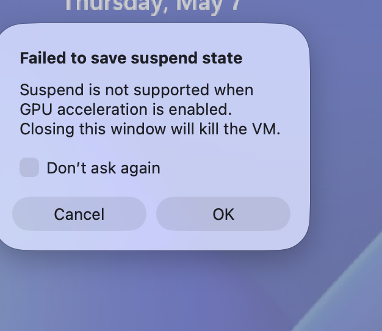

---

## Final Verification & System Maintenance

To ensure the long-term stability of the assignment results, a final verification of the virtualization environment was performed.

### Step 1: VM State Verification
Confirming the "Stopped" state and proper resource allocation (4GB RAM) for the Windows 11 ARM64 machine.

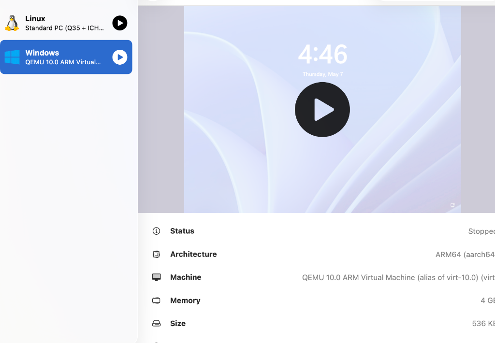

### Step 2: System Backup (Cloning)
To prevent data loss and preserve the successful configuration, a full clone of the virtual machine was created ("Windows 11 - Final Backup").

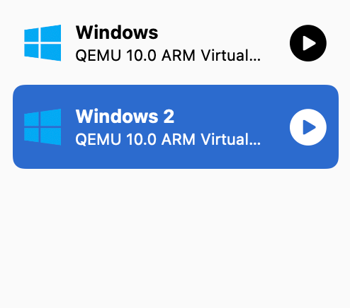

---
*End of Assignment Document*
